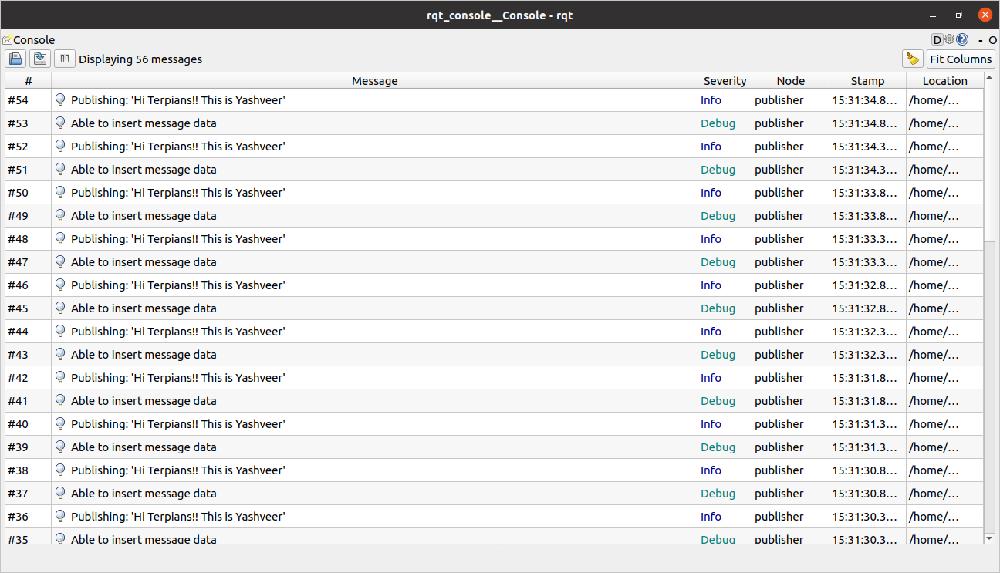

[](https://opensource.org/licenses/MIT)
# Overview
    This repo contains the programming assignment (ROS Publisher/Subscriber) for ENPM808x, ROS2.
* Name : Yashveer Jain
* UID : 119252864

## Assumption
Ros2 is already setup locally and have a workspace `ros2_ws`.

## build
* First Time build
```
cd ~/ros2_ws/src
git clone <repo>
cd ..
colcon build
. install/setup.bash
```
* After editing `beginner_tutorials` build:
```
colcon build --packages-select beginner_tutorials
. install/setup.bash
```

## Run

* publisher in one terminal (with loglevel start from debug)
```
ros2 run beginner_tutorials talker --ros-args --log-level debug
```
* subscriber in another terminal (with loglevel start from debug)
```
ros2 run beginner_tutorials listener  --ros-args --log-level debug
```
* Running service client (change `new_string_to_publish` to the desired string want to publish)
```
ros2 run beginner_tutorials server_client <new_string_to_publish> --ros-args --log-level debug
```
## Run with launch file
```
ros2 launch beginner_tutorials custom_launch.yaml frequency:=1ros2 launch beginner_tutorials custom_launch.yaml frequency:=1
```
* Note: frequency must be integer value.
* It will launch publisher and subscriber nodes, and server node within publisher.
* so, server_client node need to be called separately and message can be edited.

## Checks
### cpplint:
```
cpplint --filter=-build/c++11,+build/c++17,-build/namespaces,-build/include_order $( find . -name *.cpp | grep -vE -e "^./build/" -e "^./vendor/" )
```
### cppcheck:
```
cppcheck --enable=all --std=c++11 --check-config --suppress=missingIncludeSystem $( find . -name *.cpp | grep -vE -e "^./build/" -e "^./vendor/" )
```
## rqt_console log output


## Dependencies:
* rclcpp
* std_msgs
